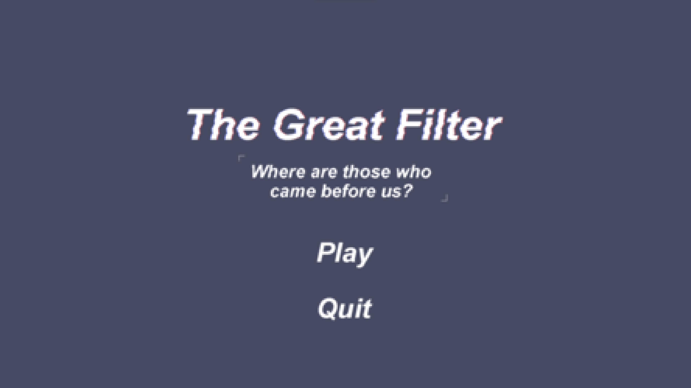

# The Great Filter

A short, narrative text games revolving around progressing your civilization. The Great Filter is a concept that attempts to answer why we as a civilization have not been contacted by or observed alien civilization. Our game, "The Great Filter", explores the process of developing civilization and why they disappear.

Game submission for My First Game Jam: Summer 2023: [My First Game Jam: Summer 2023](https://itch.io/jam/my-first-game-jam-summer-2023)

## Features
- Over 50 random events
- At least 3 minutes of gameplay
- Narrative story telling

## Screenshots

